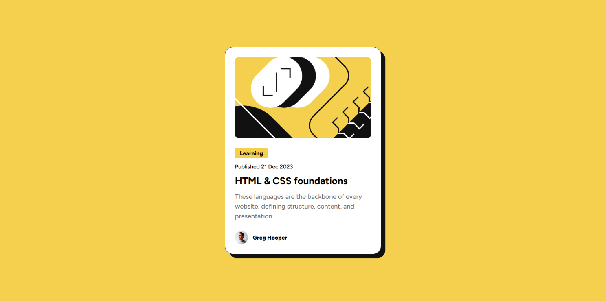
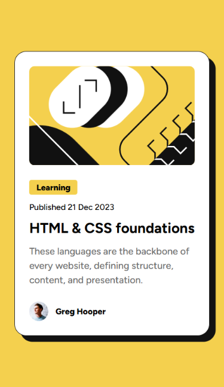
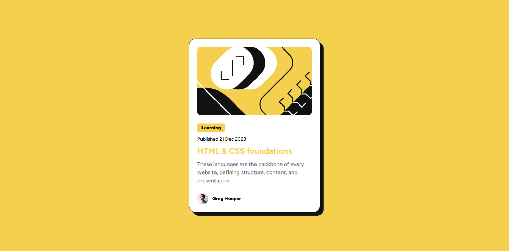

# Frontend Mentor - Blog preview card solution

This is a solution to the [Blog preview card challenge on Frontend Mentor](https://www.frontendmentor.io/challenges/blog-preview-card-ckPaj01IcS). Frontend Mentor challenges help you improve your coding skills by building realistic projects. 

## Table of contents

- [Overview](#overview)
  - [The challenge](#the-challenge)
  - [Screenshot](#screenshot)
- [My process](#my-process)
  - [Built with](#built-with)
  - [What I learned](#what-i-learned)
  - [Useful resources](#useful-resources)
- [Author](#author)
- [Acknowledgments](#acknowledgments)

## Overview

### The challenge

Users should be able to:

- See hover and focus states for all interactive elements on the page

### Screenshot

Desktop Version

Mobile Version

Hover state

## My process

### Built with

- Semantic HTML5 markup
- CSS custom properties
- Flexbox
- Media Query

### What I learned

This was an easy challenge and I didn't much things because this project is already to apply the basics of HTML and CSS!

### Useful resources

I only used ChatGPT just to realize that I can use box shadow for the black shadow thing instead of making a whole new div and using position codes to place it.

## Author

- Frontend Mentor - [@iyedo](https://www.frontendmentor.io/profile/iyedo)

## Acknowledgments

Thanks for reading all that lol!
